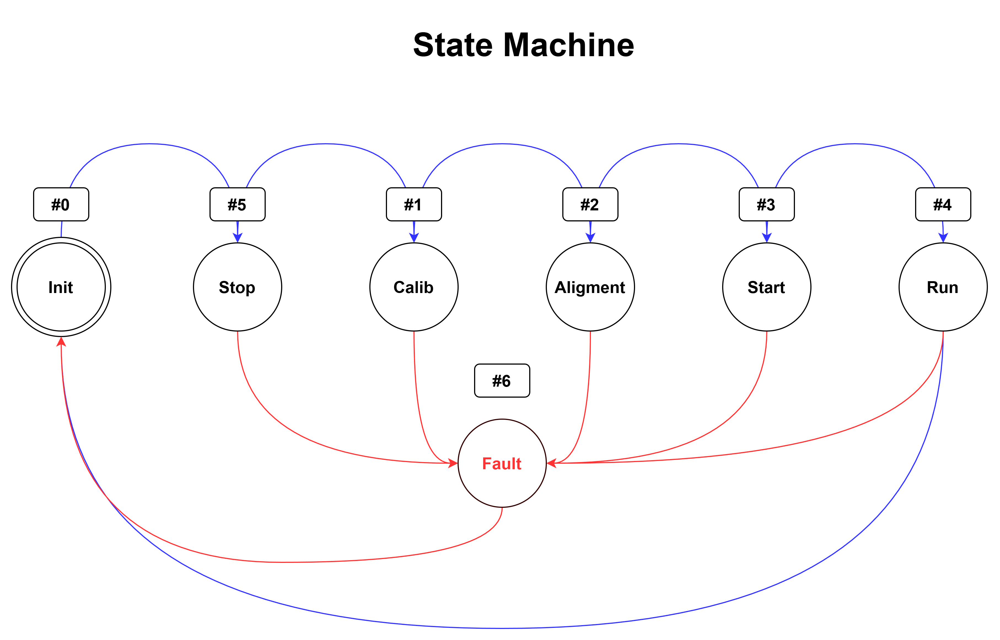
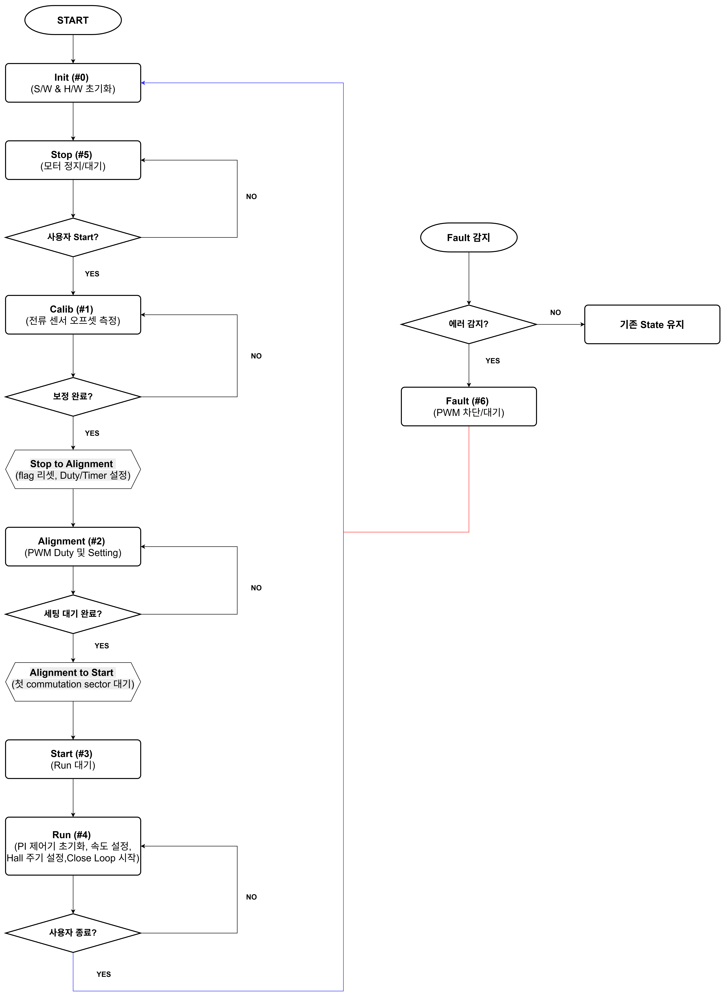

# ⚡ NXP S32K144 BLDC 6-Step Motor Control System

## 📖 Project Overview
본 프로젝트는 **NXP S32K144 MCU**를 기반으로 **BLDC 모터의 6-Step 제어**를 구현한 펌웨어입니다.  
시스템은 두 가지 제어 모드(**Sensorless BEMF** 및 **Hall Sensor**)를 지원하며, 안전성을 최우선으로 고려한 **State Machine** 아키텍처와 **이중 루프(속도/전류) 제어기**를 탑재하고 있습니다.

---

## 🏗️ 1. System Architecture

시스템은 엄격한 상태 관리(State Machine)를 통해 동작하며, 모든 상태에서 발생하는 하드웨어 결함(Fault)을 감지하여 시스템을 보호합니다.

### 1.1 State Machine Diagram
시스템의 전체 동작 흐름과 예외 처리(Fault) 경로입니다.


### 1.2 State Definition
| State Index | State Name | Description | Key Function |
| :---: | :--- | :--- | :--- |
| **#0** | **Init** | MCU 및 주변장치 초기화 | `AppInit()` |
| **#5** | **Stop** | 사용자 입력 대기 (Standby) | `AppStop()` |
| **#1** | **Calib** | 전류 센서 0점(Offset) 보정 | `AppCalib()` |
| **#2** | **Alignment** | 로터 강제 정렬 (센서리스 필수) | `AppAlignment()` |
| **#3** | **Start** | 초기 기동 시퀀스 (Open-Loop / First Commutation) | `AppStart()` |
| **#4** | **Run** | 정상 운전 (Closed-Loop Speed Control) | `AppRun()` |
| **#6** | **Fault** | **[Safety]** 비상 정지 및 PWM 차단 | `AppFault()` |

---

## ⚙️ 2. Control Logic Flowchart

시스템의 상세 제어 알고리즘 순서도입니다. **준비 단계(육각형)**를 통해 상태 전환 전 필요한 설정을 수행합니다.


---

## 🎮 3. Control Methods (Dual Mode)

본 프로젝트는 하드웨어 구성에 따라 두 가지 제어 방식을 지원합니다.

### 3.1 Mode A: Sensorless Control (BEMF)
위치 센서 없이 모터의 **역기전력(BEMF)**을 감지하여 구동합니다.

* **Zero-Crossing (ZC) 감지**: Floating 상의 BEMF가 0V를 교차하는 시점을 검출.
* **Commutation Timing**: `ZC 발생 시점 + 30° Delay` 후 상 전환.
* **Startup Sequence**:
    1.  **Alignment (#2)**: DC 전류를 인가하여 로터를 초기 위치로 고정.
    2.  **Open-Loop (#3)**: 위치 피드백 없이 강제 가속 (Ramp-up).
    3.  **Closed-Loop (#4)**: BEMF 신호가 안정되면 동기 제어로 전환.

### 3.2 Mode B: Hall Sensor Control
3개의 홀 센서 디지털 신호를 이용하여 정밀하게 제어합니다.

* **Position Sensing**: $120^\circ$ 위상차를 가진 3비트 신호(1~6)로 현재 섹터 파악.
* **Instant Start**: 정렬(Alignment) 과정 없이 현재 위치에 맞는 PWM 패턴 즉시 출력.
* **Interrupt Driven**: 홀 신호 변화(Edge) 시 인터럽트가 발생하여 즉시 Commutation 수행.

---

## 🧠 4. Core Algorithms

### 4.1 Speed & Current Cascade Control
안정적인 속도 제어와 과부하 방지를 위해 **이중 루프 제어기**를 사용합니다.

1.  **Speed Loop (Outer)**: `Target RPM` vs `Actual RPM` 오차를 **PI 제어**하여 목표 전류(Torque) 생성.
2.  **Current Limit (Inner)**: 생성된 목표 전류가 `Limit`를 초과하지 않도록 **PWM Duty를 제한(Clamping)**.
    > **Effect**: 모터가 구속(Stall)되거나 급가속 시 과전류로 인한 하드웨어 소손 방지.

### 4.2 Fault Protection Logic (The Red Path 🔴)
State Machine의 **빨간색 경로**에 해당하는 전역 감시 로직입니다.

* **Cycle-by-Cycle Current Limit**: 매 PWM 주기마다 ADC 전류 측정.
* **Over-Voltage / Under-Voltage**: DC Link 전압 모니터링.
* **Logic**:
    ```c
    /* 전역 보호 로직 (어느 상태에서든 동작) */
    if (Current > MAX_CURRENT || Voltage > MAX_VOLTAGE) {
        App_State = FAULT_STATE (#6); // 상태 강제 전환
        PWM_Output_Disable();         // 하드웨어 즉시 차단
    }
    ```

---

## 🛠️ Development Environment
* **MCU**: NXP S32K144
* **Hardware**: NXP S32K144evb + linix 45zwn24-40 3 phase bldc motor
* **IDE**: S32 Design Studio for ARM
* **Driver**: NXP SDK (ADC, FTM, PDB, FreeMASTER)
* **Tool**: FreeMASTER (Real-time Tuning & Monitoring)
